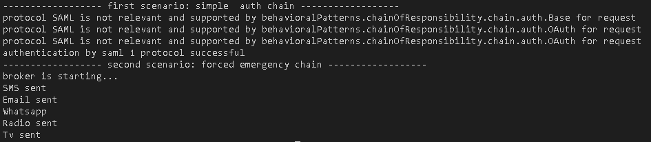

# Entwurfsmuster
design patterns implemented with Java

<!-- toc -->

- [creation pattern](#creation-pattern)
- [structure pattern](#structure-pattern)
- [behavioral pattern](#behavioral-pattern)
  * [Command pattern](#command-pattern)
    + [intention](#intention)
    + [first impression out of definition](#first-impression-out-of-definition)
    + [basic idea of the pattern](#basic-idea-of-the-pattern)
    + [UML](#uml)
    + [actors](#actors)
    + [additional thoughts](#additional-thoughts)
    + [sequence](#sequence)
    + [when to use](#when-to-use)
    + [rating](#rating)
    + [sample implementation](#sample-implementation)
    + [related patterns and thoughts](#related-patterns-and-thoughts)
  * [Chain of Responsibility pattern: todo](#chain-of-responsibility-pattern-todo)
    + [intention](#intention-1)
    + [first impression out of definition](#first-impression-out-of-definition-1)
    + [basic idea of the pattern](#basic-idea-of-the-pattern-1)
    + [UML](#uml-1)
    + [actors](#actors-1)
    + [additional thoughts](#additional-thoughts-1)
    + [sequence](#sequence-1)
    + [when to use](#when-to-use-1)
    + [sample implementation](#sample-implementation-1)
    + [related patterns and thoughts](#related-patterns-and-thoughts-1)

<!-- tocstop -->

## creation pattern

## structure pattern

## behavioral pattern
### Command pattern
#### intention
"Encapsulate a request as an object, thereby letting you parameterize clients with different requests, queue or log requests, and support undoable operations." - GoF

#### first impression out of definition
|part of definition| interpretation|
|--|--|
|"Encapsulate a request as an object"| isolate a request/method/invocation and wrap those as an object|
|"thereby letting you parameterize clients with different requests"| so you can make this wrapped objects parameterisable by clients for different scenarios|
|"queue or log requests"| you can concatenate an amount of wrapped request objects in a wait list to invoke them in an order. You can also log this wrapped requests |
|and support undoable operations| you also can design undo operations to this wrapped requests |
|||

#### basic idea of the pattern
- a request will be store in an object
- this object can be stored and passed around like other objects
- this wrapped request object is a "command"

#### UML

#### actors
|actor|responsibility| example |
|--|--|--|
|client| the guy who configures/instanciate concrete commands and sets it receiver| the user who configures the google assist commands and connects it to receiver |
|invoker|the guy who provides commands in a defined way. The guy who triggers the commands| a smarthome remote with buttons for different commands
|Command|this guy is an abstract class or interface which provides the interface-method called "execute"| kind of smarthome protocol |
|concrete command| concrete capsulated request, which enables the execution of a operations. It is the bridge between concrete receiver and requested action | turn on my AVM Fritz smart bulb or turn on my smart thermostat |
|receiver|this is a concrete class which will receive a command and executes the messages/requests from concrete command class| for example the concrete AVM Smart bulb or AVM smart thermostat |

#### additional thoughts
There are often scenarios where a client has to execute multiple commands by one invoke-operation. For Example: "I want to turn on all bulbs and set the temperature in my living room to 23 degree."

That means one invoker method will execute a series of commands. In GoF they are speaking about **macro commands**.

A macro command is also a subclass of a abstract command interface. They do not have explicit receiver, because they are executing a list of other commands. These concrete commands have their receiver. 

The client should **never** call the execute methods from the commands. You always should add an invoker between client and commands. So the invoker invokes the execute methods from the commands. 

The invoker should has the ability to **register** new commands and **executes** them. So the Client can registers his wish about commands. The invoker invokes the execute methods. 

In reality the command classes need information like parameters or data as foundation to operate. You should use **Dependency Injection** to inject an **ExecutionContext** object. This kind of mechanism fullfills the requirement that a lot of other clients and environments can use this command. Do not work with a parameter list to map the needed data for commands.  

#### sequence
- client creates a concrete command object
- client specify a receiver
- invoker stores command
- invoker trigger command by calling execute-inteface method on the command
- concrete command executes actions on receiver

consequences:
- decoupling from invoker and receiver ( by carrieng the request out )

#### when to use
- if you need a "callback" (like in javascript) for object orientated languages. It is a object-oriented replacement for callbacks - GoF
- if you want to specify, queue and execute requests at different time
- if requests should be independent from its original request
- if you want to support an undo mechanism
- if you want to have a history list of all your executions and unexecutions
- if you want to implement transactions. Each command has the interface "execute" so every transaction has to fullfil this interface. You can easily extend your system with transactions/commands.
- if you don't know about the receiver
- or you don't want to know about the receiver or receivers
- if you don't have to know about the operation 
- or you don't want to know about the operation

#### rating
good:
- decoupling from a request, his trigger and the receiver
- a better abstraction and with the usage of so called "executionContext" it is useable in a lot of contexts
- reuseability of commands
- requests are storeable and can be invoke to a later time ( also serializable and invoke lately)
- simple do/undo implementation design

bad:
- increasing amount of classes

#### sample implementation
[sourcecode](behavioralPatterns/command/Client.java)

#### related patterns and thoughts
- the command pattern is an object orientated solution for callback functions
- with lamda functions in Java 8 there is no need for command pattern anymore

Related source:
http://radar.oreilly.com/2014/12/using-the-command-pattern-with-lambda-expressions.html
https://www.w3schools.com/java/java_lambda.asp

### Chain of Responsibility pattern: todo
#### intention
"Avoid coupling the sender of a request to its receiver by giving more than one object a change to handle the request. Chain the receiving objects and pass the request along the chain until an object handles it." - GoF

#### first impression out of definition
|part of definition| interpretation|
|--|--|
|"Avoid coupling the sender of a request to its receiver"| decouple the request from a sender and his receiver |
|"by giving more than one object a change to handle the request"| use a bunch of objects trying to handle the request because the sender maybe do not know the relevant operations and objects |
|"Chain the receiving objects"| put the object in contract, which possibly are relevant |
|"and pass the request along the chain until an object handles it."| every object in contract and chain has the chance to handle the request. The exit scenario should be reached, once a object handled the request. |
|||

#### basic idea of the pattern
- a handler interface defines a contract for concrete handlers
- every handler knows the successor 
- every handler can handles a request or forward it to the known successor

#### UML

#### actors
|actor|responsibility| example |
|--|--|--|
|client| the guy who triggers the first object of the chain |
|abstract handler| the interface which defines the handle and setNextHandler method |
|concrete handler| the guy who can handle requests it is responsible for. Either it handles the request or it forwards the request to the successor
|||

#### additional thoughts
In your application there could be a lot of chain objects you can **reuse**. But if the existing chain of responsibility **does not fit** to your new requirements. You have to define **redundant** objects to map your needs. 

It is also possible that a chain executes **every part** of the chain because every part is **relevant**. 

With an **abstract base class** for handler, we can bundle **redundant** methods like the check method for supported handlers or the nextHandler method to invoke the successor. 

It is also **not necessary** to create a bunch of different classes to have a chain. A chain can also have a bunch of objects with **different status** by the same class. 

#### sequence
- client executes handle method from first object out of the chain
- first concrete handler tries to handle request
- it forwards the request to its successor, if it could not be handle by itself
- same procedure will be repeated until a chain object can handle the request 

#### when to use
- if the sender does not know the relevant objects to call
- if a request is dependent from a context, so the target objects are
- if you want to decouple a request to its potentially target objects
- if a sender do not know that a couple of objects handles its request and especially if the sender do not know it at the start
- if the list of objects, that can handle should be specified dynamically

h other. Not one chain object has to know about the whole chain structure, they only have to know their successor. 
- more flexibility: by changing the chain on runtime it is very flexible to add responsibilities to scenarios

bad:
- unhandled request are not known by the client

#### sample implementation
[sourcecode](behavioralPatterns/chainOfResponsibility/Client.java)

#### related patterns and thoughts
tbd